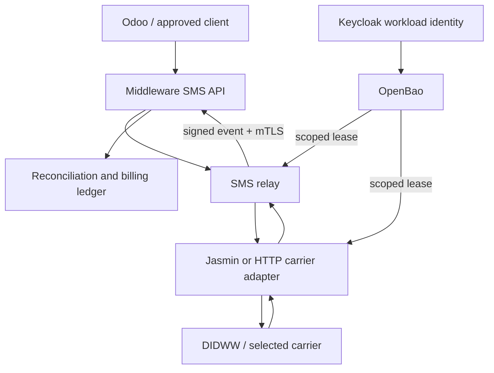

# Production SMS carrier, OpenBao, and Middleware readiness design

Status: proposed, fail-closed  
Scope: DIDWW/carrier onboarding, Jasmin, relay/API, Middleware callbacks, Keycloak release gate, evidence, and approvals  
Secret values in Git: prohibited

## Decision summary

Production SMS remains disabled until every gate in this document has machine-verifiable evidence and named approval. OpenBao is the authority for runtime secret material; it is not an authorization bypass and stores no customer message content.

The confirmed production server address is `65.109.65.169`. It is a routing target, not the TLS service identity. The canonical Middleware service identity already used by Codestra repositories is:

- URL authority: `https://middleware.internal.codestra.agency`
- production Telnexa event path: `POST /api/v1/events/telnexa`
- private service address currently documented elsewhere: `10.40.0.1`
- transport: TLS with mutual client authentication
- identity rule: certificates validate the DNS name, never an unverified numeric address

Before deployment, prove that the intended ingress path to `65.109.65.169` is correctly routed and that `middleware.internal.codestra.agency` resolves as designed from the calling network. Direct IP callbacks remain forbidden unless a separately reviewed ingress design supplies a certificate with the required IP SAN; normal callbacks must use the canonical DNS name.

DIDWW must be treated as a candidate carrier until its account confirms the required production interface. Public DIDWW documentation describes HTTP SMS trunks; do not assume that a DIDWW portal login supplies SMPP credentials. The carrier capability gate must record whether the selected interface is SMPP or HTTP and map it through a carrier adapter without changing Middleware's canonical event contract.

## Architecture



No browser, Odoo user session, observability component, or general automation identity may read carrier credentials.

## Repository ownership

| Concern | Authoritative repository | Required change/evidence |
|---|---|---|
| Secret paths, policies, rotation, audit | `Codestra-OpenBao` | This design; policy/config implementation in a later reviewed PR |
| Public/internal SMS API, idempotency, reconciliation | `Middleware-` | Carrier-neutral command API and Telnexa callback ingestion |
| Carrier/Jasmin adapter, DLR/MO normalization | `telnexa` | DIDWW/SMPP-or-HTTP adapter and bounded test harness |
| Image digests and production deployment | `codestra-production-platform` | Signed digest pins, manifests, rollback evidence |
| Workload identity and vulnerability closure | `Keycloak` | Patched release, service account audience/scope, all required checks green |

## OpenBao namespaces and records

Use KV v2 metadata and values under environment-separated mounts. Exact physical mount names are deployment-specific; the logical contract is:

```text
codestra/staging/telnexa/carriers/didww/connection
codestra/staging/telnexa/carriers/didww/callbacks
codestra/staging/telnexa/carriers/didww/limits
codestra/staging/telnexa/middleware/mtls
codestra/staging/telnexa/middleware/event-signing

codestra/production/telnexa/carriers/didww/connection
codestra/production/telnexa/carriers/didww/callbacks
codestra/production/telnexa/carriers/didww/limits
codestra/production/telnexa/middleware/mtls
codestra/production/telnexa/middleware/event-signing
```

Required fields are names only; values are written out-of-band by an approved operator:

| Record | Required keys |
|---|---|
| `connection` | `interface`, `host`, `port`, `system_id`, `password`, `system_type`, `bind_mode`, `tls_required`, `provider_account_id` |
| `callbacks` | `dlr_url`, `mo_url`, `callback_auth_type`, `callback_secret`, `source_allowlist` |
| `limits` | `sender_ids`, `destination_allowlist`, `messages_per_second`, `daily_segment_limit`, `monthly_spend_limit_minor`, `currency` |
| `middleware/mtls` | `ca_pem`, `client_cert_pem`, `client_key_pem`, `server_name` |
| `middleware/event-signing` | `key_id`, `hmac_secret`, `algorithm` |

Never store message bodies, destination histories, DLR payload archives, approval attachments, or billing ledgers in OpenBao.

## Least-privilege policies

- `telnexa-carrier-staging`: read staging DIDWW connection/callback/limit paths only.
- `telnexa-carrier-production`: read production DIDWW connection/callback/limit paths only; no list on sibling services.
- `telnexa-middleware-events-production`: read production Middleware mTLS and event-signing paths only.
- CI identities: may validate policy syntax and required metadata, but cannot read secret values.
- human operators: write through audited break-glass or approved operator workflow; normal UI users get no read-back.
- leases/tokens: short TTL, renewable only by the workload, revoked on deployment rollback or carrier disable.
- audit: record identity, path, operation, request ID, and outcome; never log secret values.

## Carrier capability and approval record

Before credentials are written, create an approved, non-secret carrier record containing:

- carrier legal name and account owner;
- interface: `smpp` or `http`;
- production and sandbox endpoints;
- TLS requirements and certificate validation rules;
- bind type for SMPP (`transceiver` preferred, otherwise explicit transmitter/receiver pair);
- approved sender IDs or originating numbers;
- allowed destination countries/network classes;
- DLR states and provider error-code map;
- inbound/MO addressing and callback behavior;
- encoding support: GSM-7, UCS-2, concatenation/SAR or UDH;
- provider throughput/burst behavior;
- settlement currency, rate-card version, taxes, and balance alert thresholds;
- support/escalation contacts and maintenance window.

## Middleware event contract

Telnexa/relay sends events only to:

```text
POST https://middleware.internal.codestra.agency/api/v1/events/telnexa
```

Required controls:

- mTLS certificate with the approved private CA and DNS server-name validation;
- bearer API key plus HMAC-SHA256 signed raw request body;
- `X-Event-Id`, `X-Timestamp`, `X-Signature`, and `Idempotency-Key`;
- timestamp skew limit and replay rejection;
- stable `message_id`, `provider_reference`, `correlation_id`, and tenant boundary;
- duplicate delivery returns the original accepted result without a second ledger mutation;
- unknown/out-of-order DLRs are quarantined and reconciled, not silently discarded;
- MO messages are normalized into a distinct inbound event type and never mistaken for DLR;
- credentials, phone numbers, message bodies, and signature material are redacted from logs and traces.

Network allowlists should use the private VLAN/service network. A public server address, if later confirmed, must not replace the canonical TLS name.

## Release and image gate

Production deployment is blocked unless all are true:

1. the Keycloak vulnerability has a linked fix, patched artifact, vulnerability rescan, and required workflow checks green;
2. API, Jasmin/adapter, relay, and migration images are referenced by immutable `sha256` digest;
3. image signatures and provenance attestations validate against the approved identity;
4. SBOM and critical/high vulnerability policy pass, with time-bounded approved exceptions only;
5. deployment renders without floating tags and has a tested rollback digest set;
6. OpenBao policies pass syntax, deny-boundary, staging/production isolation, and audit tests;
7. runtime service identities have exact audience/scope and cannot retrieve unrelated secrets;
8. kill switch defaults closed and external delivery requires the approved production mode.

A green workflow means every required check on the exact commit SHA passed. Approval or success on an older SHA is not transferable.

## Bounded carrier sandbox test

Use an allowlist of owner-controlled test numbers, a hard segment count, spend ceiling, time window, and a closed-by-default kill switch.

| Test | Expected evidence |
|---|---|
| MT GSM-7 | one accepted submit, stable IDs, final DLR, one billing mutation |
| DLR mapping | provider states map to canonical terminal/non-terminal states |
| MO inbound | one inbound message, authenticated callback, correct tenant/number routing |
| Multipart | ordered reassembly or documented segment handling; exact segment billing |
| Unicode | UCS-2 payload preserved; segmentation and cost recorded |
| Throttling | configured MPS enforced; retry respects backoff and provider limits |
| Duplicate callback | idempotent response; no duplicate timeline/billing mutation |
| Out-of-order callback | quarantined/reconciled to a valid final state |
| Provider timeout | bounded retry, dead-letter/quarantine, visible operator state |
| Reconciliation | submitted, provider, DLR, and billed counts balance by IDs |

Minimum negative tests: invalid signature, expired timestamp, wrong client certificate, wrong audience, disallowed destination, unapproved sender, limit exhausted, kill switch closed, and production secret request by a staging identity.

Do not use customer traffic for certification. Preserve redacted evidence with timestamps, exact image digests, commit SHA, carrier test references, and reconciliation totals.

## Go-live approvals

The activation record must contain explicit approval from:

- compliance: consent, opt-out/suppression, sender registration, destination rules, retention;
- security: Keycloak closure, OpenBao policies, mTLS/HMAC, image trust, audit and redaction;
- billing/finance: rate card, prepaid balance or credit, spend limits and reconciliation;
- service owner: runbook, support/escalation, SLO, dashboards, rollback;
- production change owner: exact commit/digests, change window, canary bounds.

No single approval substitutes for another. Missing, expired, or SHA-mismatched evidence keeps the kill switch closed.

## Deployment sequence

1. Confirm selected carrier interface and approved production account without copying credentials into GitHub.
2. Verify routing to confirmed server `65.109.65.169`; prove DNS for `middleware.internal.codestra.agency`, firewall policy, TLS hostname validation, and mTLS.
3. Apply Keycloak fix; rerun vulnerability scan and the complete required workflow.
4. Write staging secrets through the audited OpenBao operator path.
5. Deploy signed, digest-pinned staging images and execute all sandbox tests.
6. Review reconciliation and negative-test evidence.
7. Record compliance, security, billing, service-owner, and change-owner approvals.
8. Write production secrets; issue short-lived workload access.
9. Deploy exact approved digests with kill switch closed.
10. Open a one-message transactional canary, verify DLR/MO and reconciliation, then enable only the approved limits.
11. Monitor error rate, DLR latency, spend, queue depth, bind health, callback authentication failures, and reconciliation drift.
12. On breach, close kill switch, revoke leases, roll back digests, and reconcile before retry.

## Exit criteria

Production SMS is ready only when carrier capability, secret custody, callback trust, Middleware reachability, Keycloak closure, signed images, bounded sandbox evidence, reconciliation, and all named approvals are complete on the same release SHA. Until then the correct system state is disabled.
