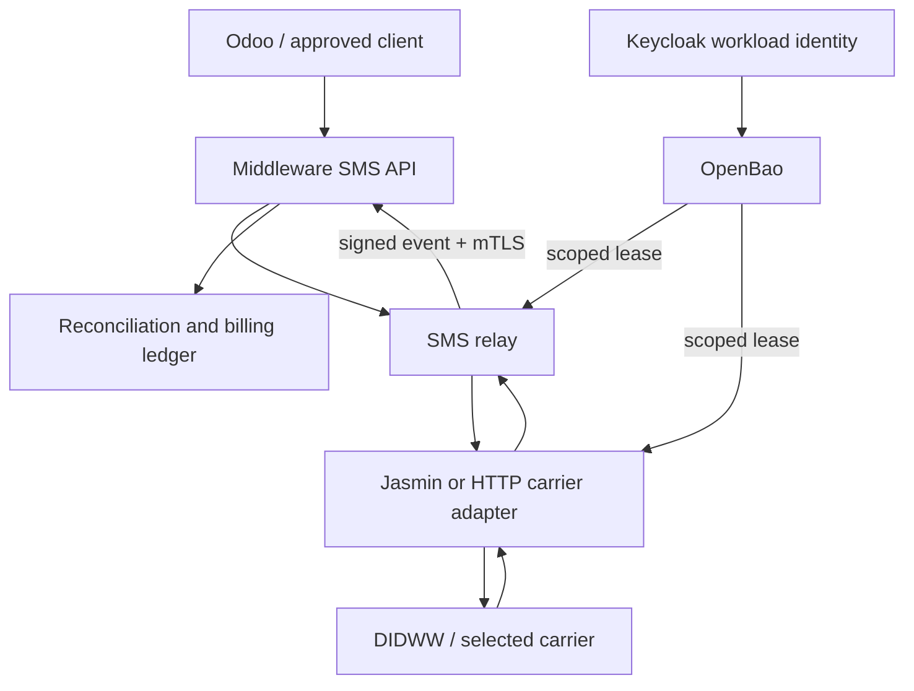

# Production SMS carrier, OpenBao, and Middleware readiness design

Status: proposed, fail-closed  
Scope: DIDWW/carrier onboarding, Jasmin, relay/API, Middleware callbacks, Keycloak release gate, evidence, and approvals  
Secret values in Git: prohibited

## Decision summary

Production SMS remains disabled until every gate in this document has machine-verifiable evidence and named approval. OpenBao is the authority for runtime secret material; it is not an authorization bypass and stores no customer message content.

The confirmed production server address is `65.109.65.169`. It is a routing target, not the TLS service identity. The canonical Middleware service identity already used by Codestra repositories is:

- URL authority: `https://middleware.internal.codestra.agency`
- production Telnexa event path: `POST /api/v1/events/telnexa`
- private service address currently documented elsewhere: `10.40.0.1`
- transport: TLS with mutual client authentication
- identity rule: certificates validate the DNS name, never an unverified numeric address

Before deployment, prove that the intended ingress path to `65.109.65.169` is correctly routed and that `middleware.internal.codestra.agency` resolves as designed from the calling network. Direct IP callbacks remain forbidden unless a separately reviewed ingress design supplies a certificate with the required IP SAN; normal callbacks must use the canonical DNS name.

DIDWW is the selected production carrier and the account owner has confirmed that DIDWW provides SMPP. The implementation must use an SMPP carrier adapter without changing Middleware's canonical event contract. The actual SMPP host, port, system ID, password, system type, bind mode, and TLS requirements remain secret/operator inputs and must be loaded into OpenBao out-of-band.

## Architecture



No browser, Odoo user session, observability component, or general automation identity may read carrier credentials.

## Repository ownership

| Concern | Authoritative repository | Required change/evidence |
|---|---|---|
| Secret paths, policies, rotation, audit | `Codestra-OpenBao` | This design; policy/config implementation in a later reviewed PR |
| Public/internal SMS API, idempotency, reconciliation | `Middleware-` | Carrier-neutral command API and Telnexa callback ingestion |
| Carrier/Jasmin adapter, DLR/MO normalization | `telnexa` | DIDWW/SMPP-or-HTTP adapter and bounded test harness |
| Image digests and production deployment | `codestra-production-platform` | Signed digest pins, manifests, rollback evidence |
| Workload identity and vulnerability closure | `Keycloak` | Patched release, service account audience/scope, all required checks green |

## OpenBao namespaces and records

Use KV v2 metadata and values under environment-separated mounts. Exact physical mount names are deployment-specific; the logical contract is:

```text
codestra/staging/telnexa/carriers/didww/connection
codestra/staging/telnexa/carriers/didww/callbacks
codestra/staging/telnexa/carriers/didww/limits
codestra/staging/telnexa/middleware/mtls
codestra/staging/telnexa/middleware/event-signing
codestra/staging/telnexa/middleware/oidc

codestra/production/telnexa/carriers/didww/connection
codestra/production/telnexa/carriers/didww/callbacks
codestra/production/telnexa/carriers/didww/limits
codestra/production/telnexa/middleware/mtls
codestra/production/telnexa/middleware/event-signing
codestra/production/telnexa/middleware/oidc
```

Required fields are names only; values are written out-of-band by an approved operator:

| Record | Required keys |
|---|---|
| `connection` | `interface`, `host`, `port`, `system_id`, `password`, `system_type`, `bind_mode`, `tls_required`, `provider_account_id` |
| `callbacks` | `dlr_url`, `mo_url`, `callback_auth_type`, `callback_secret`, `source_allowlist` |
| `limits` | `sender_ids`, `destination_allowlist`, `messages_per_second`, `daily_segment_limit`, `monthly_spend_limit_minor`, `currency` |
| `middleware/mtls` | `ca_pem`, `client_cert_pem`, `client_key_pem`, `server_name` |
| `middleware/event-signing` | `key_id`, `hmac_secret`, `algorithm` |
| `middleware/oidc` | `issuer`, `token_url`, `client_id`, `client_secret`, `audience`, `scope` |

Never store message bodies, destination histories, DLR payload archives, approval attachments, or billing ledgers in OpenBao.

## Least-privilege policies

- `telnexa-carrier-staging`: read staging DIDWW connection/callback/limit paths only.
- `telnexa-carrier-production`: read production DIDWW connection/callback/limit paths only; no list on sibling services.
- `telnexa-middleware-events-staging`: read staging Middleware mTLS, event-signing, and OIDC paths only; deny production and unrelated services.
- `telnexa-middleware-events-production`: read production Middleware mTLS, event-signing, and OIDC paths only; deny staging and unrelated services.
- CI identities: may validate policy syntax and required metadata, but cannot read secret values.
- human operators: write through audited break-glass or approved operator workflow; normal UI users get no read-back.
- OpenBao access tokens: short TTL, renewable only by the workload, revoked on deployment rollback or carrier disable. KV v2 values are static secrets, not revocable dynamic leases. Token revocation prevents future reads but does not invalidate already-fetched values.
- credential revocation: disable or rotate the provider credential at DIDWW, revoke/replace the client certificate and enforce that revocation at ingress, rotate the HMAC key and remove the old verifier key, and revoke/rotate the Keycloak client credential. Keep ingress and delivery disabled until already-issued access tokens have expired or been rejected and negative tests prove the old material is unusable. Record rotation evidence without secret values.
- audit: record identity, path, operation, request ID, and outcome; never log secret values.

## Carrier capability and approval record

Before credentials are written, create an approved, non-secret carrier record containing:

- carrier legal name and account owner;
- interface: `smpp` (confirmed by Ralph Appolon on 2026-09-12);
- production and sandbox endpoints;
- TLS requirements and certificate validation rules;
- bind type for SMPP (`transceiver` preferred, otherwise explicit transmitter/receiver pair);
- approved sender IDs or originating numbers (pending exact values and country registrations);
- destination policy ceiling: worldwide except the United States; each country remains disabled until carrier support, sender registration, consent, sanctions/export screening, and local compliance approval are recorded;
- DLR states and provider error-code map;
- inbound/MO addressing and callback behavior;
- encoding support: GSM-7, UCS-2, concatenation/SAR or UDH;
- provider throughput/burst behavior (pending exact MPS/TPS limit);
- settlement currency, rate-card version, taxes, and balance alert thresholds;
- initial spend ceiling: USD 2.00 per newly created customer/tenant account, fail closed when exhausted; account-grain interpretation must be confirmed before implementation;
- support/escalation contacts and maintenance window.

## Middleware event contract

Telnexa/relay sends events only to:

```text
POST https://middleware.internal.codestra.agency/api/v1/events/telnexa
```

Required controls:

- mTLS certificate with the approved private CA and DNS server-name validation;
- short-lived OIDC client-credentials bearer token (maximum 300 seconds), issued by `https://auth.codestra.co/realms/codestra` to `telnexa-gateway`, audience `middleware-api`, scope `sms.events.publish`, and explicitly approved service-account `tenant_ids`;
- the OIDC client secret, mTLS material, and HMAC key are mounted secret files. Fetch access tokens at runtime; do not store bearer API keys or access tokens in Git or ordinary environment values;
- canonical v1 HMAC-SHA256 over newline-separated `version`, `method`, `path`, `timestamp`, `eventId`, `sourceClientId`, and the SHA256 of the exact raw request body, as defined by Middleware's `config/api-webhook-contracts.json` and Telnexa PR #36;
- `Authorization`, `Content-Type`, `Idempotency-Key`, `X-Codestra-Event-Id`, `X-Codestra-Event-Type`, `X-Codestra-Source`, `X-Codestra-Tenant-Id`, `X-Codestra-Timestamp`, `X-Codestra-Signature`, and `X-Correlation-Id`; the idempotency key must equal the authenticated event ID, and envelope/header tenant, source and event identities must agree;
- timestamp skew limit and replay rejection;
- stable `message_id`, `provider_reference`, `correlation_id`, and tenant boundary;
- duplicate delivery returns the original accepted result without a second ledger mutation;
- unknown/out-of-order DLRs are quarantined and reconciled, not silently discarded;
- MO messages are normalized into a distinct inbound event type and never mistaken for DLR;
- credentials, phone numbers, message bodies, and signature material are redacted from logs and traces.

Network allowlists should use the private VLAN/service network. A public server address, if later confirmed, must not replace the canonical TLS name.

Carrier ingress is a separate trust boundary. SMPP DLR/MO must arrive on the approved authenticated, transport-protected bind and match the configured provider account. If an HTTP callback adapter is separately approved, validate the provider's documented authentication/signature, freshness, replay identity, allowed source, and tenant/message association before normalization or forwarding. Missing capability or failed validation keeps that adapter disabled. A relay signature does not certify an unvalidated carrier event.

## Release and image gate

Production deployment is blocked unless all are true:

1. [Keycloak issue #114](https://github.com/appolon1908-hue/Keycloak/issues/114) has an approved vulnerability record naming the exact CVE/advisory, affected component and version, fixed version, patched image digest, scanner/database version, rescan evidence, and required workflow checks on the exact source SHA. The Keycloak/Netty finding's precise identifier and fixed artifact remain unresolved here: missing fields block release; an unrelated clean scan is insufficient;
2. API, Jasmin/adapter, relay, and migration images are referenced by immutable `sha256` digest;
3. image signatures and provenance attestations validate against the approved identity;
4. SBOM and critical/high vulnerability policy pass, with time-bounded approved exceptions only;
5. deployment renders without floating tags and has a tested rollback digest set;
6. OpenBao policies pass syntax, deny-boundary, staging/production isolation, and audit tests;
7. runtime service identities have exact audience/scope and cannot retrieve unrelated secrets;
8. kill switch defaults closed and external delivery requires the approved production mode.

A green workflow means every required check on the exact commit SHA passed. Approval or success on an older SHA is not transferable.

## Bounded carrier sandbox test

Use an allowlist of owner-controlled test numbers, a hard segment count, the USD 2.00 per-new-account spend ceiling, a time window, and a closed-by-default kill switch. The United States must be explicitly denied at both API policy and carrier-adapter layers.

| Test | Expected evidence |
|---|---|
| MT GSM-7 | one accepted submit, stable IDs, final DLR, one billing mutation |
| DLR mapping | provider states map to canonical terminal/non-terminal states |
| MO inbound | one inbound message, authenticated callback, correct tenant/number routing |
| Multipart | ordered reassembly or documented segment handling; exact segment billing |
| Unicode | UCS-2 payload preserved; segmentation and cost recorded |
| Throttling | configured MPS enforced; retry respects backoff and provider limits |
| Duplicate callback | idempotent response; no duplicate timeline/billing mutation |
| Out-of-order callback | quarantined/reconciled to a valid final state |
| Provider timeout | bounded retry, dead-letter/quarantine, visible operator state |
| Reconciliation | submitted, provider, DLR, and billed counts balance by IDs |

Minimum negative tests: invalid signature, expired timestamp, wrong client certificate, wrong audience, disallowed destination, unapproved sender, limit exhausted, kill switch closed, and production secret request by a staging identity.

Also prove rejection of mismatched event/idempotency/tenant headers, altered signed metadata, revoked credentials, invalid carrier authentication, stale/duplicate carrier callbacks, disallowed carrier sources, and provider-account mismatches. Verify both staging event-credential access and denial of production event credentials.

Do not use customer traffic for certification. Preserve redacted evidence with timestamps, exact image digests, commit SHA, carrier test references, and reconciliation totals.

## Go-live approvals

The activation record must contain explicit approval from:

- compliance: consent, opt-out/suppression, sender registration, destination rules, retention;
- security: Keycloak closure, OpenBao policies, mTLS/HMAC, image trust, audit and redaction;
- billing/finance: rate card, prepaid balance or credit, spend limits and reconciliation;
- service owner: runbook, support/escalation, SLO, dashboards, rollback;
- production change owner: exact commit/digests, change window, canary bounds.

Approval record (2026-09-12):

| Role | Approver | State |
|---|---|---|
| Production owner | Ralph Appolon | Approved direction and bounded production preparation |
| Compliance | Independent or formally delegated approver required | Pending country-by-country evidence |
| Security | Independent or formally delegated approver required | Pending Keycloak/OpenBao/mTLS/image evidence |
| Billing/finance | Independent or formally delegated approver required | Pending rate card and USD 2.00 limit enforcement proof |
| Service/change owner | Ralph Appolon | Pending exact-SHA/digest and sandbox evidence |

No single approval substitutes for another. A person may fill multiple roles only when organizational policy formally delegates those authorities and the evidence records each role separately. Missing, expired, or SHA-mismatched evidence keeps the kill switch closed.

## Deployment sequence

1. Confirm selected carrier interface and approved production account without copying credentials into GitHub.
2. Verify routing to confirmed server `65.109.65.169`; prove DNS for `middleware.internal.codestra.agency`, firewall policy, TLS hostname validation, and mTLS.
3. Apply Keycloak fix; rerun vulnerability scan and the complete required workflow.
4. Write staging secrets through the audited OpenBao operator path.
5. Deploy signed, digest-pinned staging images and execute all sandbox tests.
6. Review reconciliation and negative-test evidence.
7. With delivery and production workload access disabled, provision and validate production records through the approved operator path. Record each KV v2 mount/path/version, certificate fingerprint and key identifier, approved provider-account reference, and policy/config digests in the release manifest; never record secret values or raw secret checksums. Pin reads to the approved versions or enforce an equivalent version check before access and activation.
8. Record compliance, security, billing, service-owner, and change-owner approvals against that exact manifest, then issue short-lived workload access. Any change to a bound secret version, identity, policy, source or artifact invalidates approval and requires validation and reapproval before activation.
9. Deploy exact approved digests with kill switch closed.
10. Open a one-message transactional canary, verify DLR/MO and reconciliation, then enable only the approved limits.
11. Monitor error rate, DLR latency, spend, queue depth, bind health, callback authentication failures, and reconciliation drift.
12. On breach, close kill switch and ingress, revoke workload access and rotate/revoke already-fetched credentials as specified above, roll back approved digests, and reconcile before retry.

## Exit criteria

The release identity is an immutable, digest-addressed manifest mapping each participating repository (`Codestra-OpenBao`, `Middleware-`, `telnexa`, `Keycloak`, and `codestra-production-platform`) to its approved full commit SHA, each deployable image to its digest and verified provenance, and each configuration and secret record to its approved digest or non-secret version identifier. Checks and evidence identify their component SHA/artifact; all activation approvals bind the complete manifest digest. A single repository SHA cannot identify this multi-repository release.

Production SMS is ready only when carrier capability, secret custody, callback trust, Middleware reachability, Keycloak closure, signed images, bounded sandbox evidence, reconciliation, and all named approvals match that release manifest. Until then the correct system state is disabled.
